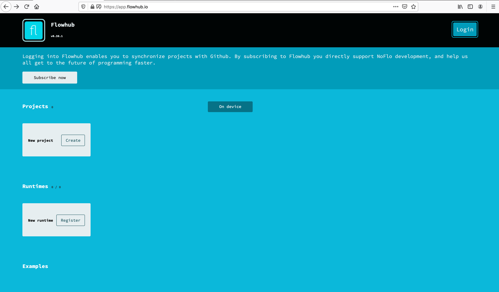
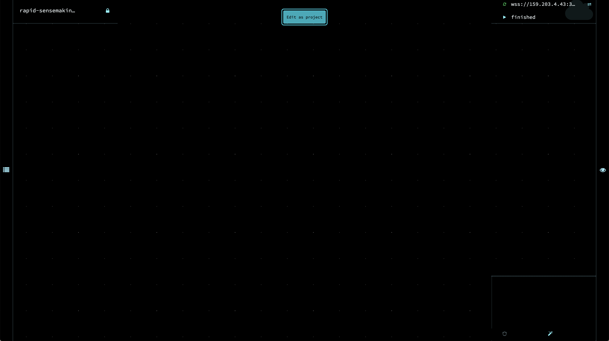
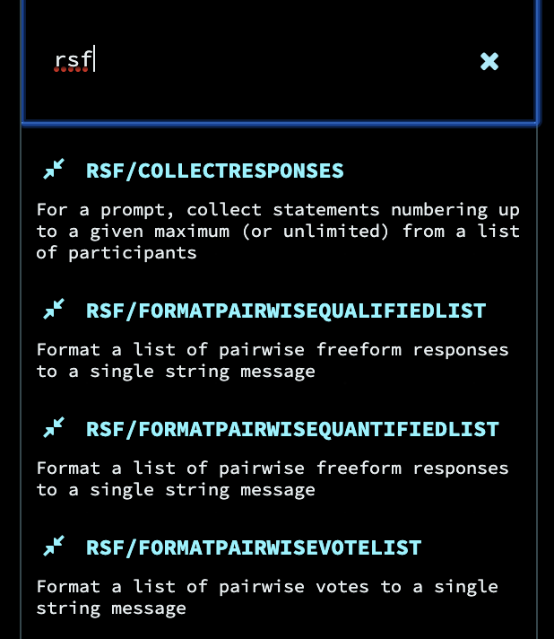

a [noflo](https://noflojs.org/) runtime, with [noflo-rsf](https://github.com/rapid-sensemaking-framework/noflo-rsf) components pre-installed on it.

All noflo component libraries currently installed: 
- noflo-core
- noflo-filesystem
- [noflo-rsf](https://github.com/rapid-sensemaking-framework/noflo-rsf)
- noflo-strings

Good for connections from clients such as [flowhub](https://app.flowhub.io/) and [rsf-electron](https://github.com/rapid-sensemaking-framework/rsf-electron).

# Usage

First time:

`npm install`

Local (insecure):

`npm run startinsecure`

Production (secure)

[set up TLS](https://github.com/noflo/noflo-nodejs#securing-the-runtime-connection) using the `openssl` steps documented here... note that this just generates a self-signed certificate, and this can come with its own challenges. Connecting to it both in the browser, or from nodejs requires overriding default security settings.
> if trying to use nodejs, see the NODE_TLS_REJECT_UNAUTHORIZED comments [here](https://github.com/rapid-sensemaking-framework/rsf-electron#noflo-runtime)

> if trying to use flowhub... navigate directly to the site of the 'insecure' websocket and then authorize it. if you don't do this, it will reject the connections
> Read on to the Noflo & Flowhub section at the bottom for more details on this.

Modify the environment variables in `./start` script file, according to the section below.

Then, you can run `npm startscript`, or simply `./start`.

## Environment Variables

Expects environment variables to be set, all of which can be done in the `./start` script:

```
# BOT_CONFIG should include configurations which make the config expected by rsf-telegramable,
# rsf-mattermostable, and rsf-smsable, keyed by `mattermostable`, `telegramable`, and `smsable`
BOT_CONFIG='{"mattermostable":"https://chat.xx@@email@email.com@@userpass@@@https://chat.yy@@user@email.com@@userpass","telegramable":{"socketUrl":"ws://localhost:3002"},"smsable":{"socketUrl":"ws://localhost:3003"}}'

# the host ip address
HOST=127.0.0.1

# the port on which to run the websocket server.
PORT=3001

# an arbitrary secret which will provide a layer of authentication between
# a noflo client, such as flowhub or noflo-rsf-client, and the server
TOP_SECRET=123jkad9s
```

## Noflo & Flowhub

Flowhub is an application designed for doing flow-based programming, or "FBP". It allows the wiring up of code "components" in order to design programs, as visually coordinated and conceptualized flows. The application requires a "runtime" in order to work, that is, an environment in which to actually execute the program designed within their application. Flowhub provides the UI for designing your application, but it's BYOR (bring your own runtime :p). This server is such a runtime, preconfigured with RSF and other code components.
What you need to be able to do to utilize this runtime, with Flowhub, follows.
1. Access Flowhub
2. Create a secure line of communication between the Flowhub app, and your noflo-rapid-sensemaking-server (n-r-s-s) runtime.
3. Create a "Project" within Flowhub, and your first "Graph", within that project.
4. Start adding rsf-* type Noflo components into your graph, and making Connections between inputs and outputs
5. Running your program

> There are a few important disclaimers to make about Flowhub:

> As Flowhubs original source of funding was a crowdfunding campaign, that funding has long since dried up, and Flowhub seems to no longer have much funding, despite having a subscription model. It is not at all clear that they are actively performing a high level of maintenance of the service, let alone new feature development.

> Data is stored in "local storage" within your browser, rather than on Flowhub servers. So Your Graphs don't leave your device, nor are they synced across devices, unless you sync a project with a Github Repository, which seems to have shaky functionality as well. Graphs can however be exported, and downloaded so that you have local file system backups of your programs.

### 1. Access Flowhub

Because your data is persisted directly to the device on which you access Flowhub, it is actually optional to "log in". If you wish to log in, it will be so that you can create and sync Github repositories with Noflo projects. It was noted that this functionality seems a bit shaky/buggy, however, in theory this is a good way to collaborate on projects, and also to back them up and access your projects from multiple devices.




### 2. Connect Flowhub and your N-R-S-S runtime
In order for Flowhub to become aware of, and form a secure connection with your established n-r-s-s runtime, it will need to know the ip address or domain name, and the "secret" known only to the runtime.

Here is how to accomplish that easily.

Upon running this server, the logs will contain an output similar to the following:
```
NoFlo runtime is now listening at wss://123.456.7.89:3001
Live IDE URL: https://app.flowhub.io/#runtime/endpoint?protocol%3Dwebsocket%26address%3Dwss%3A%2F%2F123.456.7.89%3A3001%26id%3D4d408a36-3782-41ad-bf08-d16305942397%26secret%3D9AdixGwtYpkxCoQUU
```

#### LetsEncrypt or other approved/verified Certificate
Easy! Navigate in a browser directly to the URL provided as the "Live IDE URL" in the n-r-s-s logs.
E.g. `https://app.flowhub.io/#runtime/endpoint?protocol%3Dwebsocket%26address%3Dwss%3A%2F%2F123.456.7.89%3A3001%26id%3D4d408a36-3782-41ad-bf08-d16305942397%26secret%3D9AdixGwtYpkxCoQUU`

#### Self-signed Certificate
In case the certificate used (in the TLS/SSL setup steps up top in the README) was self-signed, you will need to take an extra step here. You will need to authorize the use of the certificate within your browser.

1. Take the URL of the runtime from the logs, like `wss://123.456.7.89:3001`, and replace `wss` with `https` and navigate to that page in your browser, like `https://123.456.7.89:3001`

2. Follow a browser/OS specific method for "trusting" the self-signed certificate.
> Here is such an example for [Chrome on Mac](https://www.robpeck.com/2010/10/google-chrome-mac-os-x-and-self-signed-ssl-certificates/)
Once you have successfully authorized the Certificate, refresh the `https...` URL, and it will redirect you straight to Flowhub, with the runtime now connected.

### 3. Create a Project and first Graph

Success from the last step will mean you reach a blank looking page like this one:


The green recycling like arrow in the upper right corner, next to the address of the runtime, is a sign of the connection between Flowhub and the runtime.

Click the upper central "Edit as Project" button to turn this into a persistent, editable "Project".

You now have a blank canvas of a project before you. A quick orientation:
-  Access the project menu, and access to "Home"
-  Access the settings for this "Graph"
  - -  Download/backup this graph to your file system (as JSON)
-  Search for and browse components from the installed set, and click them to add to your Graph
-  Run this Graph as a program in the connected runtime

### 4. Adding Components, and Connections
Click the search icon () to locate and add your first component. There is a convention to prefix components that relate to one another, so you can easily filter to the RSF specific components by typing "rsf" into the text input.




### 5. Running a Program

TODO


